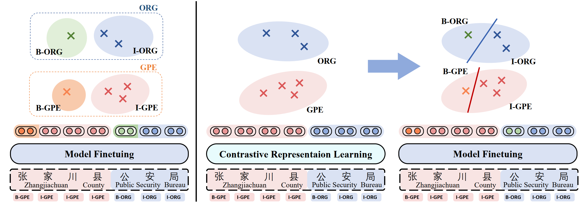

# NerCo: A Contrastive Learning based Two-stage Chinese NER Method  

This repo provides the source code & data of our paper "NerCo: A Contrastive Learning based Two-stage Chinese NER Method  " .

### Overview

NerCo is our proposed two-stage learning approach for tackling *Entity Representation Segmentation in Label-semantics*. Unlike traditional sequence labeling methods which lead to the above problem, our approach takes a two-stage NER strategy. In the first stage, we conduct contrastive learning for label-semantics based representations. Then we finetune the learned model in the second stage, equipping it with inner-entity position discrimination for chunk tags and linear mapping to type tags for each token. 



<p align="center">
    Figure1: A comparison between traditional sequence labeling methods and our proposed method NerCo. 
</p>


<p align="center">
    Figure2: Contrastive representation learning as the first stage of NerCo.  
</p>

## Dependencies

```bash
source activate # use conda
conda create --name nerco python=3.7.3 # create a virtual enviroment named nerco
conda activate nerco # activate
pip3 install torch==1.8.2+cu111 torchvision==0.9.2+cu111 torchaudio==0.8.2 -f https://download.pytorch.org/whl/lts/1.8/torch_lts.html # torch
pip3 install -r requirements.txt # requirement file
cp fastnlp_src/* ~/.conda/envs/nerco/lib/python3.7/site-packages/fastNLP/core/.
```

## Evaluate

```bash
cd evaluate
python weibo.py #taking weibo dataset for evaluation example
```

## Train

```bash
cd train
python weibo.py #taking weibo dataset for traing example
```

